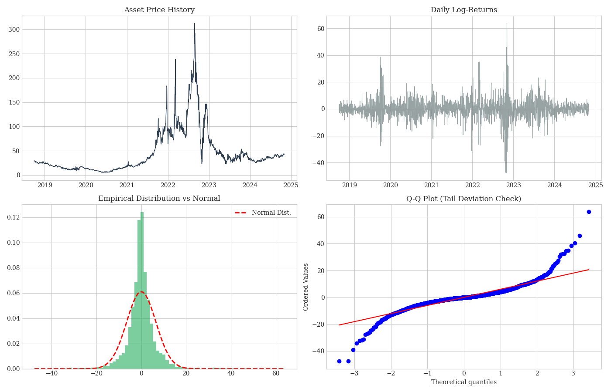
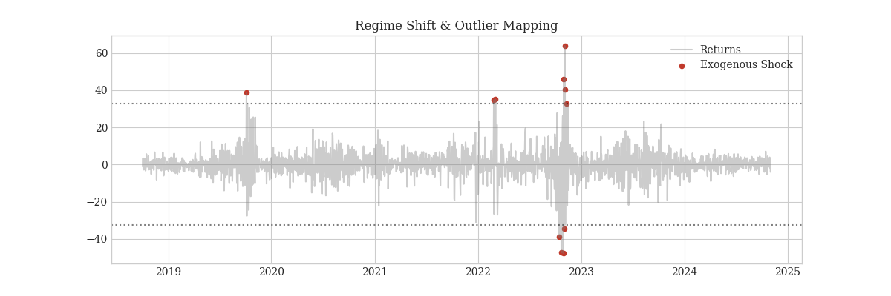
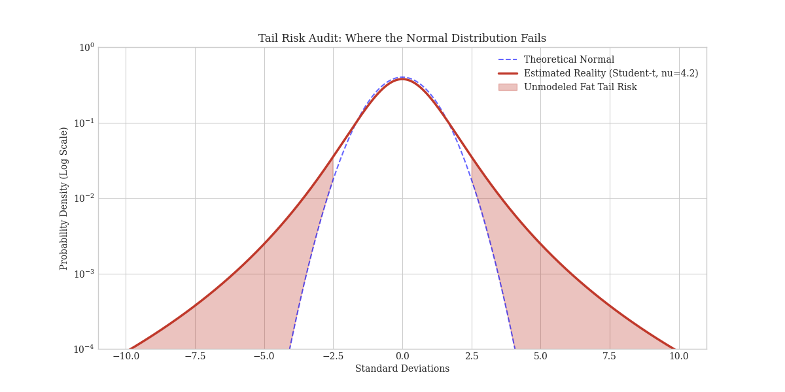
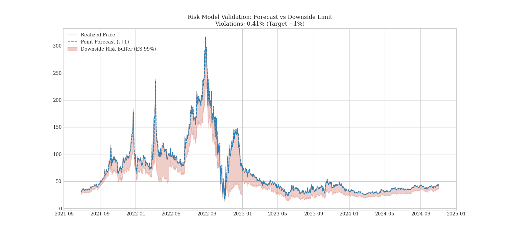

# Energy Commodity Risk Engine: Dynamic ES Forecasting

**Asset Class:** Natural Gas (Dutch TTF / Henry Hub Proxy)
**Model Architecture:** SARIMAX-EGARCH-EVT
**Objective:** Downside Risk Quantification (99% Confidence Level)

---

## Executive Summary
This project implements an institutional-grade risk engine to forecast the **Expected Shortfall (ES)** of Natural Gas prices. Unlike standard VaR models, this engine accounts for **Fat Tails (Leptokurtosis)** and **Volatility Clustering**, which are endemic to energy markets.

The model dynamically recalibrates every 50 days to adapt to structural breaks in the market regime.

---

## 1. Diagnostics & Market Structure
Before modeling, we validate the "Stylized Facts" of the time series.
* **Non-Stationarity:** Prices follow a random walk (confirmed by ADF Test).
* **Fat Tails:** Returns are not Gaussian (confirmed by Jarque-Bera).

---

## 2. Structural Breaks (Shock Detection)
Energy markets are subject to exogenous shocks (geopolitics, weather). We map these outliers (> 4 sigma) to prevent them from biasing the GARCH parameters.

---

## 3. The "Fat Tail" Problem
A normal distribution (Blue dashed line) underestimates extreme risk. Our model uses a **Student-t distribution** (Red line) to capture the real probability of black swan events.

---

## 4. Backtesting Performance
We tested the model using a Walk-Forward validation approach.
* **Blue Line:** T+1 Price Forecast.
* **Red Area:** The "Death Zone" (Downside Risk). If the black line (Real Price) drops into the red area, the model correctly anticipated the crash potential.

---

## 5. Risk Snapshot (T+1)
The final output for the Risk Committee. This shows the probability density for **tomorrow**, highlighting the exact price levels for VaR (Threshold) and ES (Average Loss).

---

### Tech Stack
* **Core:** Python, Pandas, NumPy
* **Econometrics:** Statsmodels (SARIMAX), ARCH (EGARCH)
* **Viz:** Matplotlib (Seaborn style)
